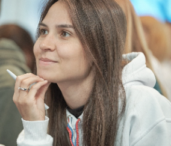

# Yurlova Victoriya

##Student Web Developer


### Contacts
* Telegram @yurlova
* Discord RS School @Viktoriya(@yurlovaviktoriya)


### About Myself

I have learned web development for 2 years. It's slowly, but I have a reason. I spend most of my time raising a child.
In the remaining time I study web technologies. I started with Python backend development. Now I'm learning frontend.
I am interested in web development. I am full of desire and enthusiasm, and I plan to look for a job in the future.


### Skills

 * HTML5, CSS3
 * JavaScript
 * React
 * Python
 * Django, DRF
 * PostgreSQL
 * Git
 * Docker
 * Gunicorn, Nginx
 * VS Code, PyCharm

 
### Code example

###### 1. Python

Polish calculator.

```
OPERATIONS = {
    '+': lambda a, b: a + b,
    '-': lambda a, b: a - b,
    '*': lambda a, b: a * b,
    '/': lambda a, b: a // b
}


class Stack:
    def __init__(self):
        self.__items = []

    def push(self, item):
        self.__items.append(item)

    def pop(self):
        if len(self.__items) == 0:
            return None
        return self.__items.pop()


def polish_calc(input_list):
    stack = Stack()
    for element in input_list:
        if element in OPERATIONS:
            operand1, operand2 = stack.pop(), stack.pop()
            operation = OPERATIONS[element]
            res = operation(operand2, operand1)
            stack.push(res)
        else:
            stack.push(int(element))
    return stack.pop()


if __name__ == '__main__':
    polish_s = list(input().split())
    print(polish_calc(polish_s))
```


###### 2. JavaScript

Count cats!
Your task is to count the cats hidden in the backyard (presented by two-dimensional Array).
Cats hide well, but their ears ("^^") are clearly visible.
Your task is to implement the countCats(backyard) function that will count cats. Good luck!

Number of cats found should be number. If no cats found, function should return 0.

For example:

`countCats([ [0, 1, '^^'], [0, '^^', 2], ['^^', 1, 2] ]) => 3`

```
function countCats(backyard) {
  const result = backyard.reduce(function(intermediateResult, area) {  
  
  const preResult = area.reduce(function(previousValue, section) {  
    if (section === '^^') {  
      previousValue += 1;  
    }  
    return previousValue;  
  }, 0);  
  intermediateResult += preResult;  
  return intermediateResult;  
  }, 0);  
  return result;
}
```


### Education and courses
* Environmental Economics (Siberian State University of geosystems and technologies, university
degree)
* [Python-developer](https://practicum.yandex.ru/backend-developer/) preparation program (Yandex Practicum, certificate)
* [Computer and Web technologies basic with Python](https://stepik.org/course/96018/) (Digitalize, in progress)
* [Web-developer](https://practicum.yandex.ru/web/) preparation program (Yandex Practicum, in progress)
* [JS/FE Pre-School](https://rs.school/js-stage0/) (The Rolling Scopes School, in progress)


### Projects

* [Foodgram](https://github.com/yurlovaviktoriya/foodgram-project) is a database of recipes (backend / Python, Django,
PostgreSQL). It is the graduation thesis for the Python-developer preparation program.
* [YaMDB service](https://github.com/yurlovaviktoriya/yamdb_final) is a database of reviews about films, books and music
(backend / Python, Django, PostgreSQL / Git). It is a group project for the Python-developer
preparation program. The code of this service implements REST API.
* [How to learn](https://github.com/yurlovaviktoriya/how-to-learn) is a landing page dedicated to learning problems,
techniques, and life hacks (frontend / HTML, CSS).
* [Russian Travel](https://github.com/yurlovaviktoriya/russian-travel) is a landing page about interesting and
fascinating places in Russia (frontend / HTML, CSS). It is a project for the Web-developer preparation program.
* [Mesto](https://github.com/yurlovaviktoriya/mesto) is a photo database of interesting places of the world (frontend /
HTML, CSS, JavaScript). It is a project for the Web-developer preparation program.


### Languages

* Russian (native speaker)
* English (A2, pre-intermediate). I do grammar and phonetic exercises. I talk about everyday topics with my family. I
watch YouTube videos to practice listening.
